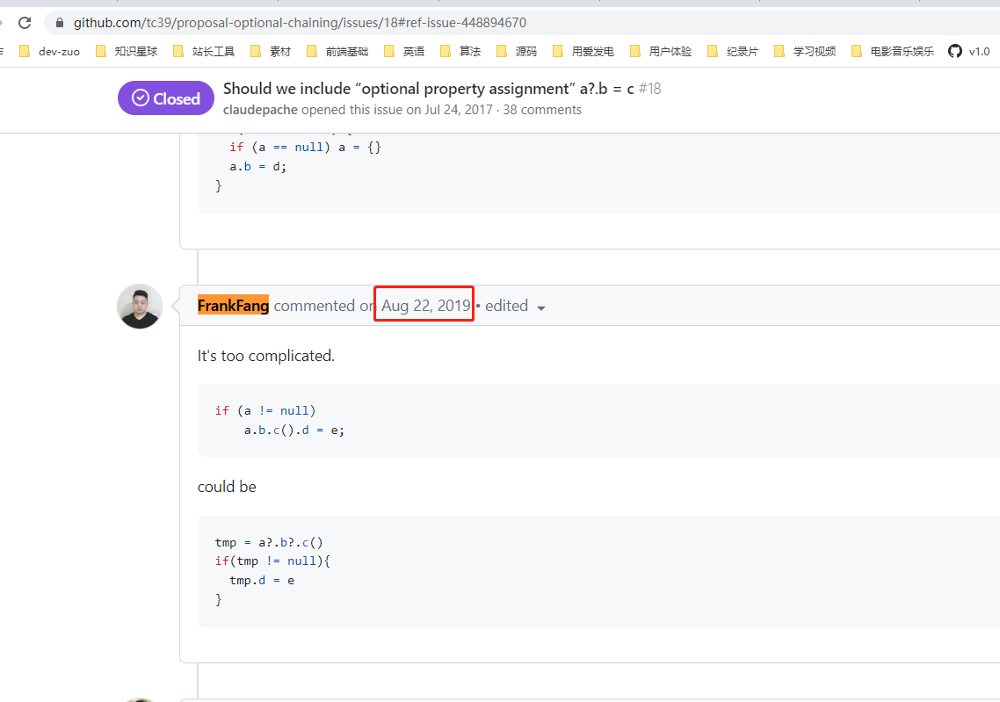

# 如何评价方应杭？

我对方应杭印象比较深的两次，是在研究两个 JS 问题的时候。

## let/const 也存在变量提升（hoisting）的问题

第一次是在 2021.07.24 号，看《你不知道的JavaScript(上卷)》这本书，并对着开源仓库 [You-Dont-Know-JS -github](https://github.com/getify/You-Dont-Know-JS) 英文文档一起看时，发现第二版更新了一个问题。

就是书中第 33 页，有说 let 进行的声明不会在块作用域中进行提升。但英文第二版 [ch5.scope-closures](https://github.com/getify/You-Dont-Know-JS/blob/2nd-ed/scope-closures/ch5.md) 中却提出 let/const 有进行提升。

于是找来阮一峰的 《es6 入门》在线链接对着看，发现他也是说 let 不存在提升。在评论区中看到了方应杭在 2017.06.29 在评论区的讨论。说明他在技术细节上确实做了思考，而且注意是 2017 年，到现在已经有快 6 年了，我那个时候还在一家小公司用 jQuery 写页面。

对应链接：[let 和 const 命令 - ES6入门](https://es6.ruanyifeng.com/#docs/let)


这个问题，我还是比较倾向 You Dont Know JS 第二版中的解释，有提升，只是在没有初始化之前，不能使用。

书中给出的证明例子，下面的代码中如果 let studentName 并没有提升到块级作用域的顶部，那 studentName 应该是可以访问到外部 var 声明的 studentName 值的，但执行后并不能拿到。

> first console.log(..) throws a TDZ error, because in fact, the inner scope's studentName was hoisted (auto-registered at the top of the scope)

```js
var studentName = "Kyle";

{
    console.log(studentName); 
    // caught ReferenceError: Cannot access 'studentName' before initialization
 
    // ???

    // ..

    let studentName = "Suzy";

    console.log(studentName);
    // Suzy
}
```

完整解释：<https://github.com/getify/You-Dont-Know-JS/blob/2nd-ed/scope-closures/ch5.md>

## JS 中 ?. 为什么不支持写(赋值)

第二次是在 2021.11.18 在研究这个问题时，在 tc39 对应的提案 issue 中找到了方应杭在 2019.08.22 参与讨论的记录，对他映像较好，能够仔细研究这个问题，并深入到 JS 标准提案的人，大概率是喜欢搞技术的，一般浮躁的开发者，不会出现在这里。

TC39 提案地址：<https://github.com/tc39/proposal-optional-chaining>

相关 issue：[Should we include “optional property assignment” a?.b = c](https://github.com/tc39/proposal-optional-chaining/issues/18#ref-issue-448894670)



我之前针对这个问题整理的笔记：[JS 中 ?. 为什么不支持写(赋值) - 语雀](https://www.yuque.com/guoqzuo/csm14e/uaym81)
